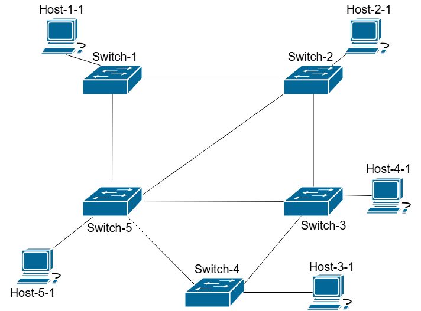
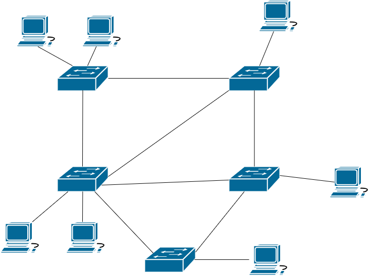
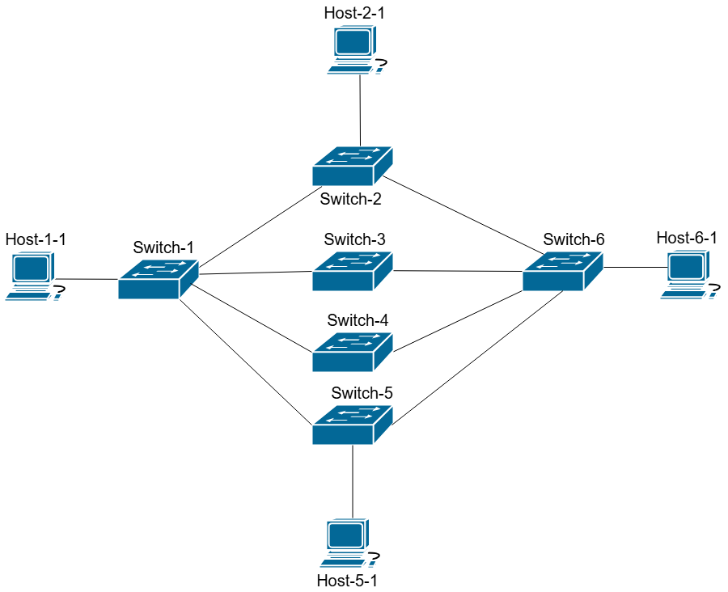

# Evaluation Results

## Single Intent Fulfillment Score Formula
(0.6 x **Tool Accuracy**) + (0.4 x **Intent Understanding**)

## Marking Scheme:
### Tool Accuracy:  
Amount of expected tool calls / 100 = marks per tool call  
Correct tool call with appropriate arguments: full marks  
Correct tool incorrect arguments: half marks  
Incorrect tool: 0 marks  

### Intent Understanding:  
0 - 30: Agent did not understand the intent or agent understood the context of the intent but made a critical error  
30 - 50: Agent understood a small amount of context for the intent, but missed some key points.  
50 - 69: Agent understood the fundamentals of the intent, but missed some points which would qualify them as fully intending the intent  
70 - 100: Agent understood the intent fully, with extra marks going for in how much detail did the correct reason the intent (did they lay out a plan to how to fulfill the intent, did they think of any edge cases)  

## Final Evaluation Score:
Sum of Single Intent Fulfillment Scores / Number of Intents Declared

### Test 1:   
Topology:  

#### Intents:  
1. Host-1-1 should be able to connect to Host-2-1 via ssh.  
2. Host-2-1 is hosting a MySQL database which Hosts 3-1, 4-1, 5-1 need access to.   
3. Host-2-1 (10.1.1.2) is a virtual IP address for a web server. Host-3-1 and Host-4-1 are implementing the web servers which will receive requests from the client Host-1-1. Host-1-1 will be sending many requests to the virtual IP address and a load balancer needs to be set up to distribute requests evenly to the server Host-3-1 and Host-4-1.  
4. Host-1-1 should not be able to ping Host-2-1.  
5. Host-5-1 is hosting a web server which will receive many requests from host-2-1 and host-3-1 and no downtime can be afforded. Configure the network accordingly. Hosts 1-1 and 4-1 should not be able to access this web server.  

#### Scores:  
1. **deepseek-chat**: 89.9
1. **gpt-4o**: 84
3. **claude-3-5-sonnet**: 60.9

### Test 2:  
Topology:  

#### Intents:  
1. Host-1-1 should be able to connect to Host-2-1 via ssh.  
2. Host-1-2 is hosting a MySQL database which Hosts 3-1, 4-1, 5-1 need access to.  
3. Host-5-2 (10.1.1.7) is a virtual IP address for a web server. Host-1-2 and Host-2-1 are implementing the web servers which will receive requests from the client Host-5-1. Host-5-1 will be sending many requests to the virtual IP address and a load balancer needs to be set up to distribute requests evenly to the server Host-1-2 and Host-2-1.
4. Host-1-1 should not be able to ping Host-2-1.  
5. Host-5-1 is hosting a web server which will receive many requests from host-2-1 and host-3-1 and no downtime can be afforded. Configure the network accordingly. Hosts 1-1 and 4-1 should not be able to access this web server.  

#### Scores:  
1. **gpt-4o**: 90.9  
2. **claude-3-5-sonnet**: 87.8
3. **deepseek-chat**: 80.9

### Test 3:  
Topology:  

#### Intents:  
1. Host-1-1 should be able to connect to Host-2-1 via ssh.  
2. Host-2-1 is hosting a MySQL database which Hosts 1-1 and 5-1 need access to.
3. Host-1-1 should be able to connect to Host-6-1 via HTTPS. The forward path from host-1-1 to host-6-1 should be implemented in a load balanced fashion, where it should be forwarded to either switch 2, switch 3 or switch 4, where each path has a weight of 33. The reverse path from host-6-1 to host-1-1 should be implemented through from switch 6, to switch 5 to switch 1.
4. Host-1-1 should not be able to ping Host-5-1.  
5. Host-5-1 is hosting a web server which will receive many requests from host-1-1 and host-6-1 and no downtime can be afforded. Configure the network accordingly. Host 2-1 should not be able to access this web server.  
6. 
#### Scores: 
1. **claude-3-5-sonnet**: 85.85
2. **deepseek-chat**: 83.25
3. **gpt-4o**: 68.81

### Overall Evaluation Averages:  
_All scores from each test was rounded to the nearest decimal_  
 
1. **deepseek-chat**: 84.6  
2. **gpt-4o**: 81.3  
3. **claude-3-5-sonnet**: 78  

